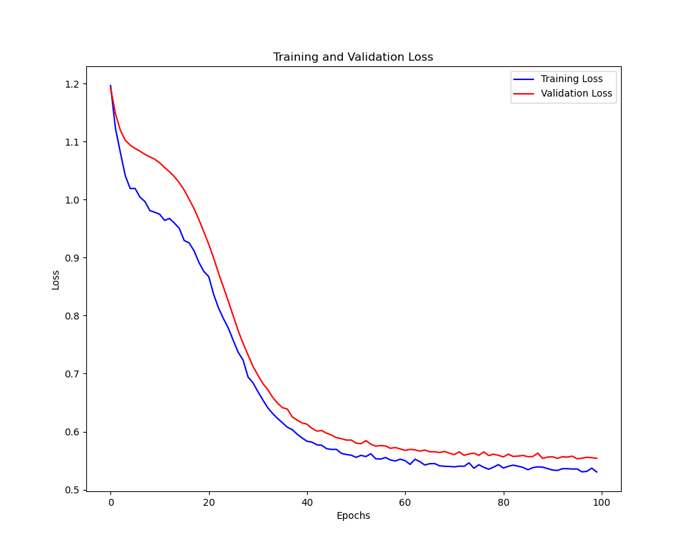

# <div align="center">Pytorch Learn</div>
Create this repository to learn pytorch. Here have two parts, first create some complex dependency dataset and second, implement a pytorch model, train this dataset

---

## [Content]
1. [Description](#description)   
2. [Dataset Create](#usage)  
3. [Model Training](#model-training)

---
## [Description]

This is a repository for learning PyTorch and implementing deep learning models using the PyTorch framework. It includes two parts: first, 'datacreate.py' creates a dataset and saves it in dataframe format. And in the second part, 'train.py' trains deep learning models on the created dataset using PyTorch. The repository is a valuable resource for beginners looking to gain hands-on experience with PyTorch and deep learning techniques. 

## [Dataset Create]

You can create a dataset using the 'datacreate.py' script provided in this repository. This script has a lot of parameters described below.
  1. name: Saving name of the dataframe.
  2. size: size of dataset.
  3. complex: How complex the dependency between features should be in the dataset.
  4. var: number independent variable or features (input size).
  5. min_value: minimum value of all variables.
  6. max_value: maximum value of all variables
  7. noise_prob: Noise probability in dataset.
  8. Normalize: Specify the normalize method used at the time of creating data ('std', 'minmax', 'none').


```python

python3 datacreate.py --name var4.csv --var 4 --max_value 2 --size 2000

``` 


## [Model Training]

After running the script with the specified parameters, the next step would be to proceed with model training using the generated dataset. 'train.py' allows you to load the dataset, split it into training and testing sets, define the model architecture, and train the model.
  1. Data: Provide the path of the saved dataset.
  2. training_size: specify the ratio of training size [0-1].
  3. eval_size: ratio of validation size [0-1].
  4. test_size: ratio of test size [0-1].
  5. Resume: If a model was already trained previously, then provide the path of the saved model.
you also can define model architecture by following parameters defined at the 'LAYERS' parameter.
  6. LAYERS: [2,2,1] - means 3 layers with 2 nodes in the first two layers and 1 node in the output layer. This information will be used to construct the neural network model for training.

```python

python3 train.py --data var4.csv

``` 
'train.py' script also called draw_figure() method to draw training and validation loss

